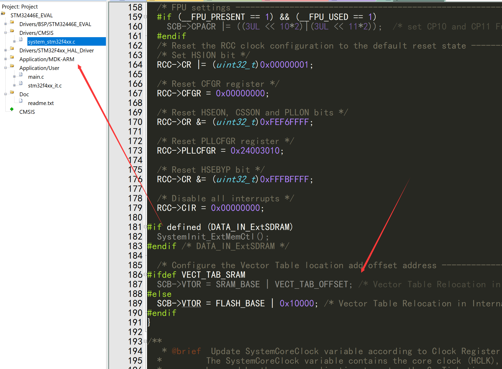
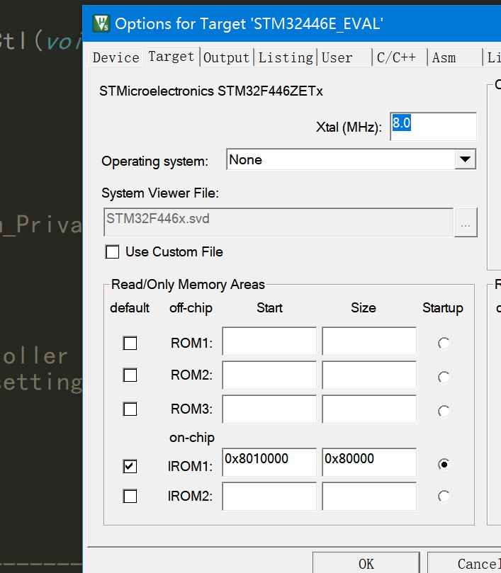
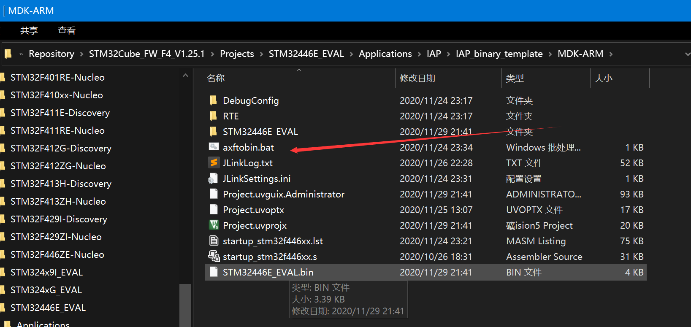
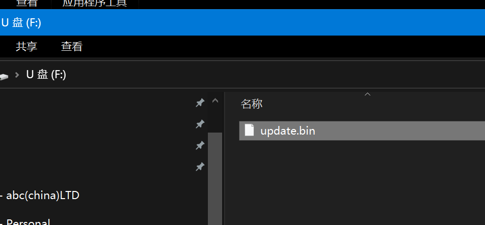
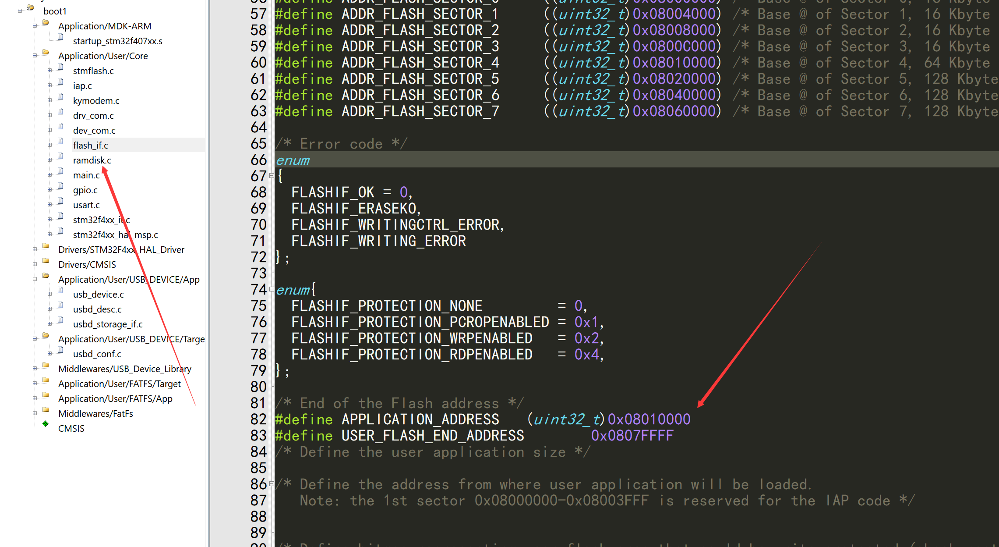
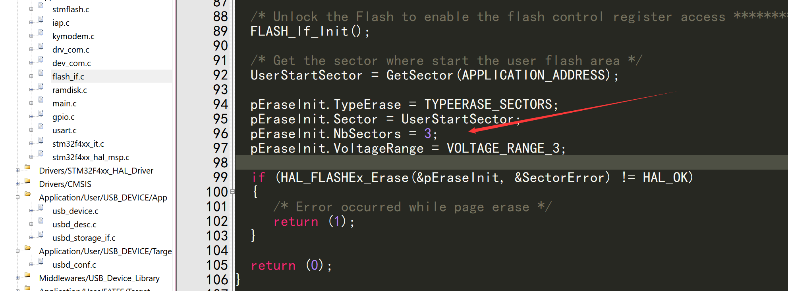

[TOC]

>
>
>kirito 2020-11-29 V1.1

# USB RAMDISK模拟U盘升级V1.0


# 原理

把内部RAM弄一个缓冲区, 先格式化为FATFS, 然后用USB模拟为U盘, 把升级文件丢过去, 然后断开USB完成升级

如果复位后３S内没检查到USB，直接运行上一个APP

# 流程

1 准备APP:

cubemx的DEMO为这个目录:

C:\Users\Administrator\STM32Cube\Repository\STM32Cube_FW_F4_V1.25.1\Projects\STM32446E_EVAL\Applications\IAP

更改中断向量表的偏移为ox10000



2 更改生成bin的地址为0x8010000



3 编译生成hex文件

4 目录下有一个bat, 双击生成bin文件



这个bat源码为

```
SET FROM_ELF_PATH="D:\programfile\productive_soft\keil\ARM\ARMCC\Bin\fromelf.exe"
%FROM_ELF_PATH% ".\STM32446E_EVAL\STM32446E_EVAL.axf" --bin --output ".\STM32446E_EVAL.bin"
```


最终生成了STM32446E_EVAL.bin

5 更改bin名字为update.bin

6 开发板重启,插入电脑, 把update.bin拖进模拟的U盘，　然后拔出USB线, 完成升级



# bootloader注意事项

1 更改APP地址后

app地址设置在flash-if.h里面设置, 如果更改了地址, 要注意更改flah_if.c的NbSectors





